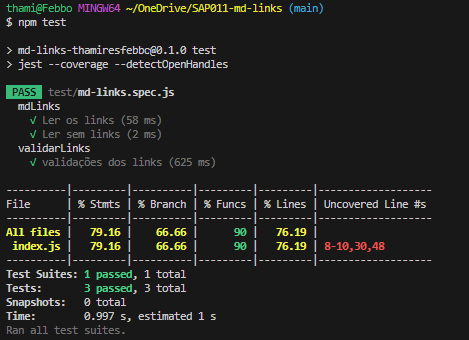

# Markdown Links

## Índice

* [1. Introdução](#1-intruducao)
* [2. Instalação](#2-instalacao)
* [3. Comandos](#3-comando)
* [4. Testes](#4-teste)
* [5. Checklist](#5-checklist)


***

## 1. Introdução

Terceiro projeto desenvolvido para o bootcamp da Laboratótia, com o obejtivo de criar uma ferramenta de linha de comando (CLI) e a sua própria biblioteca (library) em Javascript.

## 2. Instalação
```
npm install md-links-thamiresfebbo
```

## 3. Comandos

- Para extrair links de um arquivo Markdown em um diretório, execute:
```
md-links nomedodiretorio/nomedoarquivo.md
```


- Para validar links de um arquivo Markdown, execute:

```
md-links nomedodiretorio/nomedoarquivo.md --validate
```


## 4. Testes



## 5. Checklist

[✔] Instalável via ``` npm ```

[✔] Possui CLI

[✔] O usuário pode visualizar os links e validar 

[✔] O usuário pode visualizar os links quebrados

[✔] Testes unitários 

[✔] Package.json: deve possuir nome, versão, descrição, autor, licença, dependências e scripts (pretest, test e etc).
